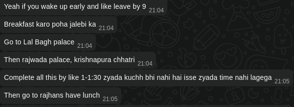
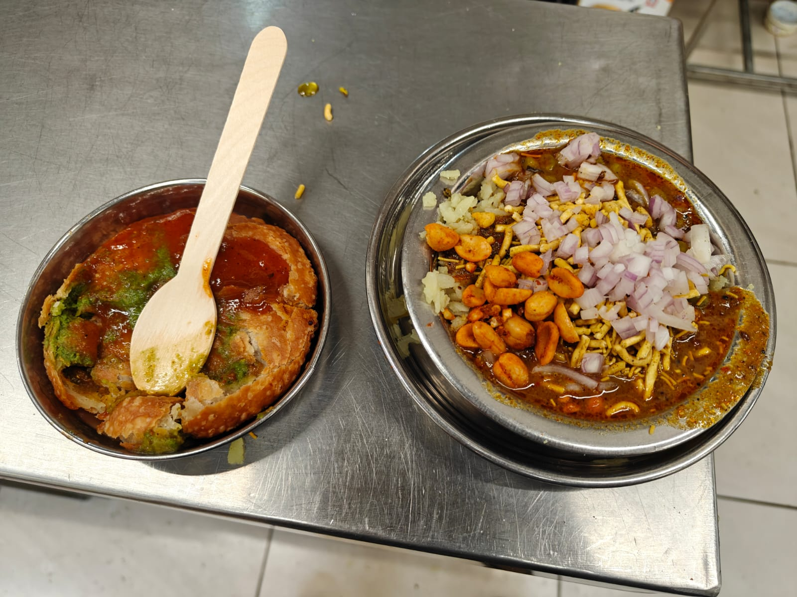
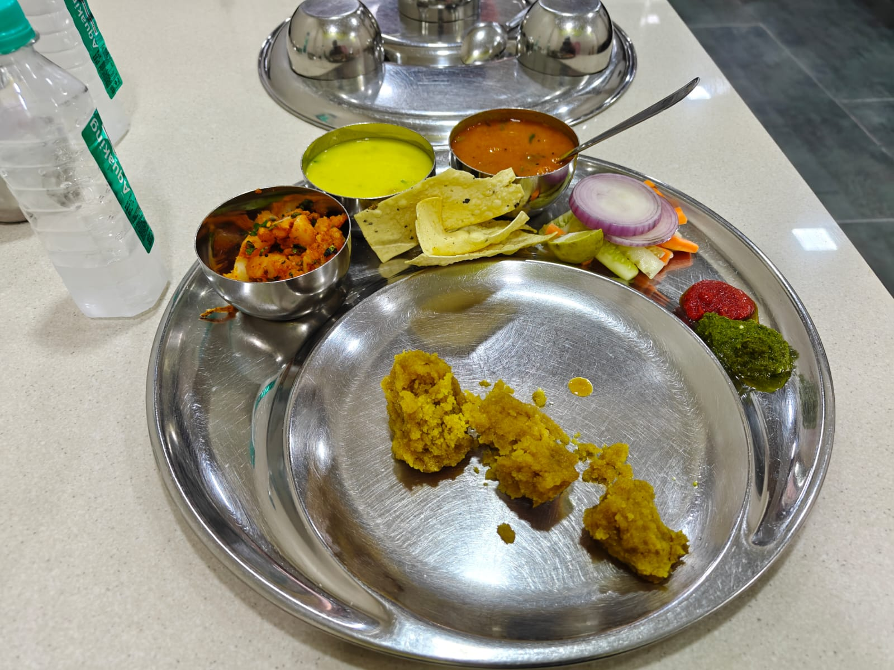
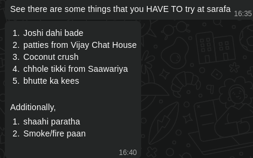

I accompanied my father to **Indore** because I was getting bored. We landed there on Sunday night and returned on Tuesday evening. So I realistically only had the Monday to roam around. **Big Mistake**. It is like the entire city is asleep on Monday. No shops are open, barely any resturants and no places to visit. And the funniest part is noone tells you about it. I am not searching _**"Is Indore closed on Monday"**_ but rather _**"Things to do in Indore on a Monday"**_ and still no information about things being closed.

Now maybe it is my mistake that I did not forsee it, but it sure is a mood-kill to go out wanting to go to all sorts of tourist places only to get there and find out that its **closed**. 

The amount of people I bothered to get a proper consise plan is insane. And honestly I was pretty excited. Its my first time in **Madhya Pradesh** and also my vacations were going on sooo **I WANTED TO ROAM AROUND AHHHH**

But I digress, now onto what all I had in what limited things I could find (keep in mind its been more than two weeks since I am writing this so I would be forgetting some details).

## Breakfast | [JMB Moti Tabela](https://maps.app.goo.gl/Hb3hvAsf7Xu9LoaZ7) 

### The Food

What I had 

- **Aloo Kachori**
- **Usal Poha**

Oh my god for the price, this was such a **warm and filling** breakfast. 

I still remember the spices mixing in the **_Kachori_** and the soft filling and the cruncy external layer. Personally I am not a huge fan on **Jeera** in my food getting in my teeth so that was something I had to deal with. But other than that, I loved the combination of flavours that the Kachori presented. 

Now the **_Poha_** honestly was a miss for me. I had asked the person taking my order what a good option would be as I wanted something spicy and they suggested **_Usal Poha_**. Now, I admit it is my mistake to not check what it was beforehand so I wont be too harsh.

I did not like the gravy. The poha in of itself was soft and flavourful and with a little bit of **lemon juice**, it tasted amazing. The onions and sev added a great compliment of cruncy and spicy. **BUT** the gravy ruined it for me. Everything became somewhat soggy and difficult to eat texture wise. For the quantity of poha also the gravy was too much, it felt as it the gravy was the main piece and the poha the secondary.

### Extra 

I had asked an auto driver from **Rajwada Palace** to take me to a good breakfast place because I was **STARVING** and he drove me around for 15-20 minutes before bringing me to this place.

Upon entering I saw people from all walks of life enjoying their food and I knew for a fact that I was going to get good food.

Albeit it took some time to get my food and seating was sparse I was still able to enjoy my food in relative peace.

## Lunch | [Rajhans Dal Bafle](https://maps.app.goo.gl/HW8pGYWbbQLByY5R8)

### The Food

**Dal Bafle Thali** tasted amazing. The thali consisted of,

- Aloo sabji
- Kaadi
- Dal 
- Pappad
- Lehsun and Pudina chutney
- Bafle

First things first, the **bafle** with ghee was super heavy. After a long day in the sun, it was way too heavy to consume fully.

I **LOVED** the lehsun chutney. The spicy with a little bit of sour really made the flavours stand out. The dal with the bafle was really good, mixed with the aloo sabji it had a really good mix of textures having added the pappad.

Personally, again I am not a huge fan of **Kaadi** so that was left untouched. But I did try it and all I can say is that it tasted like standard Kaadi.

Honestly, some rice would have made this entire meal perfect. The aloo sabji mixed really well with the bafle but it felt like a mix of "heavy" + "heavy". So maybe a roti or rice would have been a good compliment to break up from having just fibre. 

### Extra 

This place was located at a place called **Sarafa** which is a jewellery street by day and food street by night.

I have heard really good things of this place, **BUT** keep in mind the food street only starts to open by _**9-10pm and stays open till 3am**_, which is frankly insane for people like me living almost 30km out of the main Indore City.

Also, I have tried **fire paan** in **New Delhi** and please I swear to god it is nothing special but if you like having burning fire in your mouth then sure go ahead.

## Conclusion

I think what made my experience bad were just things that noone could control, like the heat, weather, shops being closed etc.

Overall Indore is quite a peaceful city with good facilities for transport, but I do not see myself visiting here again purely because I do not see it much as a happening city.

If I want a quite and peaceful lifestyle then maybe I can consider it sure.
